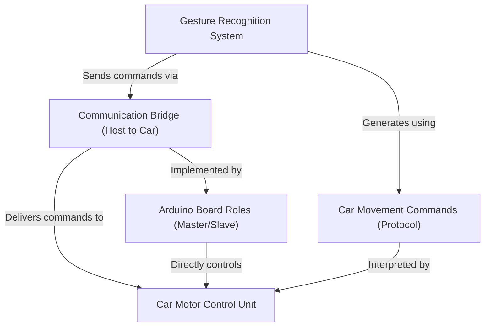

## Visual Overview

```mermaid
flowchart TD
    A0["Gesture Recognition System
"]
    A1["Communication Bridge (Host to Car)
"]
    A2["Car Movement Commands (Protocol)
"]
    A3["Car Motor Control Unit
"]
    A4["Arduino Board Roles (Master/Slave)
"]
    A0 -- "Generates using" --> A2
    A0 -- "Sends commands via" --> A1
    A1 -- "Implemented by" --> A4
    A1 -- "Delivers commands to" --> A3
    A4 -- "Directly controls" --> A3
    A2 -- "Interpreted by" --> A3
```
